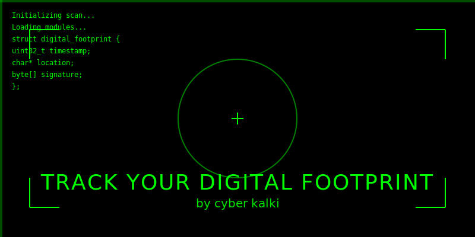

# 🕵️ Track your Digital Footprint by Cyber Kalki

  

  > 🛡️ Enterprise-Grade Digital Footprint Analysis Tool

  

## 🌟 Core Features

• 📲 **Advanced Device Fingerprinting**
  - Hardware specifications detection
  - CPU/GPU information gathering
  - Screen resolution & platform details
  - Battery status monitoring
  - Network configuration analysis

• 🌐 **Network Intelligence**
  - Real-time IP tracking
  - VPN/Proxy detection
  - ISP information gathering
  - Connection type analysis
  - Bandwidth monitoring

• 📍 **Geolocation Capabilities**
  - Precise location tracking
  - Timezone detection
  - Region verification
  - Map integration
  - Location history logging

• 🛡️ **Security Features**
  - WebRTC leak detection
  - Browser fingerprinting
  - Digital footprint analysis
  - Network node mapping
  - Connection security assessment

## 🚀 Live Demo
  <!-- YouTube Link -->
  

##  Access Tool 🔥 

## 🔐 Security Notice
This tool is designed for:
- Network monitoring
- System Diagnostics 
- System administration
- Digital forensics
- Penetration testing
- Educational purposes

### 🌐 Connect With Me

<!-- Footer -->

